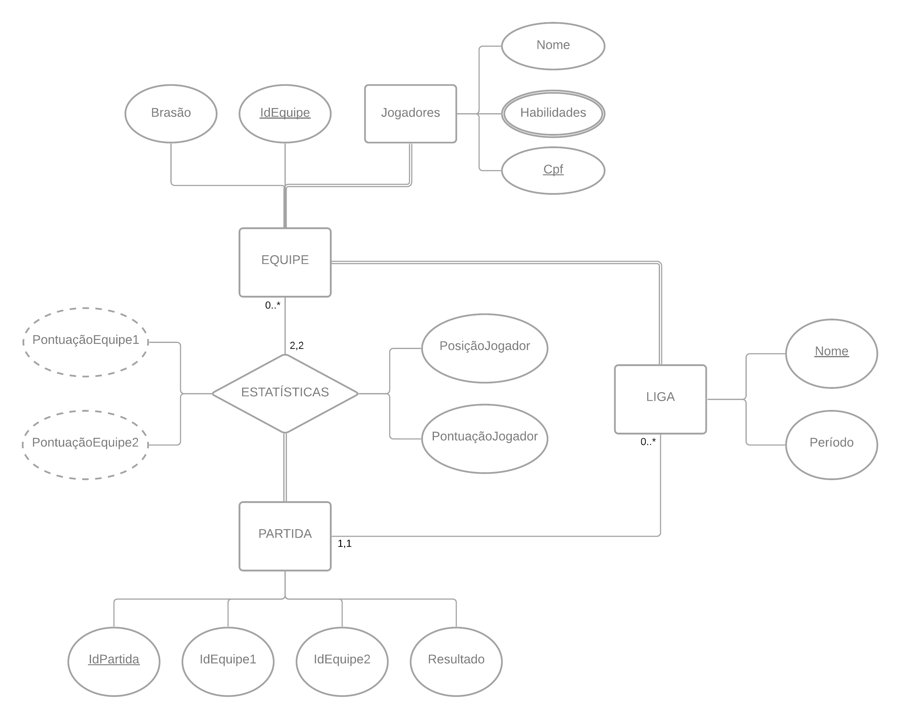
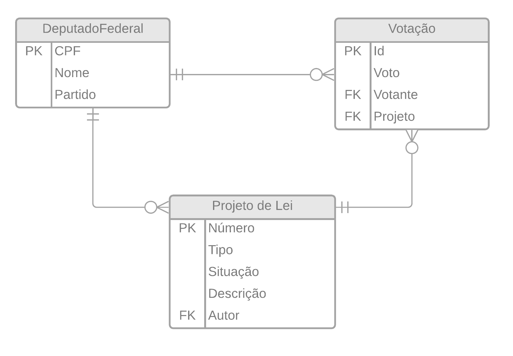

# Roteiro 06

- [Diagrama no Lucidchart](https://lucid.app/invitations/accept/4980ee72-5089-49cd-afd4-d540dc8c4c5d)

## Questão 01

Foi pensando em uma modelagem com as seguintes entidades:

- `Equipe`, que possui uma brasão, um identificador como chave primária e um conjunto de Jogadores, que é outra entidade.
- `Jogador`, que possui nome, cpf como chave e um conjunto de habilidades.
- `Liga`, com nome como chave e um período de acontecimento.
- `Partida`, com um identificador como chave, as chaves das ambas equipes participantes e o resultado da partida.

Há também uma relação chamada de `Estatísticas`, que utiliza as informações das duas equipes das partidas e adiciona também as informações de ***posição*** e ***pontuação*** de cada jogador. Sendo possível também calcular a *pontuação da equipe 1* e da *equipe 2*.

Foram utilizadas participações totais nos casos:
- `Equipe` e `Jogadores` uma vez que existes equipes sem jogadores e vice-versa.
- `Liga` e `Equipe`, da mesma forma que só pode-se existir times associados a uma `Liga` e a `Liga` não existe sem times nela.
- `Estatísticas` e `Partida` uma vez que a `Partida` utiliza as informações da `Estatísticas` para popular seus dados. 

Os quantificadores utilizados foram: 
- `Partida` (1,1) e `Liga` (0..*), uma vez que cada partida está associada em uma única `Liga` e cada `Liga` pode conter 0 ou várias partidas.
- `Equipe` (0..*) e `Estatísticas` (2,2), uma vez que cada equipe pode não ter jogado nenhuma partida, sendo assim não ter informações das estatísticas da mesma ou várias partidas. E cada estatística precisa das informações de ambos os times para existir.

## Questão 02

Foi pensando em uma modelagem com as seguintes entidades:

- `DeputadoFederal`, que possui um cpf como chave primária, nome e partido.
- `Votação`, que possui um identificador, um voto, uma chave estrangeira para seu votante e outra para o projeto que ela se refere.
- `Projeto de Lei`, com número como seu identificador, um tipo, uma situação, uma descrição e uma chave estrangeira para seu autor.

Os quantificadores utilizados foram:

- `DeputadoFederal` (1,1) e `Votação` (0..*), considerando que cada `Votação` é feita por apenas um deputado ou ela não existe e considerando que cada `DeputadoFederal` pode realizar várias votações ou nenhuma.
- `DeputadoFederal` (1,1) e `Projeto de Lei` (0..*), tendo que cada `Projeto de Lei` é criado por apenas um deputado ou ela não existe e considerando que cada `DeputadoFederal` pode realizar criar vários projetos de lei ou nenhum.
- `Projeto de Lei` (1,1) e `Votação` (0..*), uma vez que cada `Votação` está associada a apenas um `Projeto de Lei` ou não existe e que cada `Projeto de Lei` pode ter sido votado 0 ou muitas vezes.